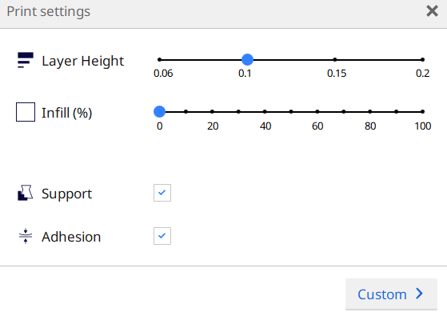
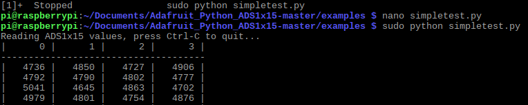

# Solar Panel Gazebo Build Instructions
## Table of contents
* [General info](#general-info)
* [Structure](#general-info)
* [Requirements](#Requirements)
* [PCB](#PCB)
* [3D Print](#3D-Printing)
* [Soldering](#Soldering)
* [Unit Testing](#Unit-Testing)
* [Assembly](#Assembly)


## General info

This repository contains the implementation of a feasibility study for automatic readings of a solar panel. The project will heavily focus on measuring the current of the solar panel in Amps.


## Structure 

1.  [Documentation](https://github.com/E-Hajj/Ahmad/tree/master/documentation) of the solar repository.  
2.  [Code](https://github.com/E-Hajj/Ahmad/tree/master/Code) contains the source code to interact with the solar panel and sensors.   
3.  [Electronics](https://github.com/E-Hajj/Ahmad/tree/master/Electronics) holds the contents of the PCB design,schematic and breadboard design.  
4.  [Raspberry pi Case](https://github.com/E-Hajj/Ahmad/tree/master/Raspberry%20pi%20case) contains the required build for the case.  
5.  [Images](https://github.com/E-Hajj/Ahmad/tree/master/image) of the project.


## Requirements

In this project you will need the required components to build this project. The total budget is  $195.34 not including tax or shipping or any other fees and prices may rise or fall. Depending if you have amazon prime and able to go to Sayal Electronics your products should arrive 1 to 5 days. While waiting for your components to arrive i would recommended starting on the pcb and 3d printing.

* **Raspbery pi 3**   *$114*
  * Power supply 2A micro usb 
  * Ethernet cable and hdmi cable
  * Sd card for the software
  * If you dont own an raspberry pi 3 i would recommed buying one from [Amazon](https://www.amazon.ca/s?k=raspberry+pi+3&ref=nb_sb_noss_2) or [Sayal Electronics](https://secure.sayal.com/STORE2/index.php). 
* **Acs712 (current sensor)** *$13.99*
  * I would recoomend getting it from [Amazon](https://www.amazon.ca/COVVY-Current-Arduino-ACS712ELC-20A-Indicator/dp/B07TQ5M9MP/ref=sr_1_2_sspa?gclid=CjwKCAiArJjvBRACEiwA-Wiqq8mHMc1JzZT1BMymqLKF9jO-BrsuzXUFn7JWweUKXyQUBpmXN-AduxoC1csQAvD_BwE&hvadid=208460006382&hvdev=c&hvlocphy=9000826&hvnetw=g&hvpos=1t2&hvqmt=e&hvrand=8319947952554246574&hvtargid=kwd-298127854743&hydadcr=4516_9156520&keywords=acs712&qid=1575398013&sr=8-2-spons&psc=1&spLa=ZW5jcnlwdGVkUXVhbGlmaWVyPUFJWVVBN1pEVTJGQlomZW5jcnlwdGVkSWQ9QTA3MjUwNTgzM0tNWklaQzJVSjI0JmVuY3J5cHRlZEFkSWQ9QTA3MDIwMzUyMTZFUjhCNTRQRU1DJndpZGdldE5hbWU9c3BfYXRmJmFjdGlvbj1jbGlja1JlZGlyZWN0JmRvTm90TG9nQ2xpY2s9dHJ1ZQ==) becuase it comes in a pack of 2 incase one breaks or is faulty.  
* **Ads1115 (Analog to Digital Converter)** *$15.99*
   * [Amazon](https://www.amazon.ca/gp/product/B07GBYY54P/ref=ppx_yo_dt_b_asin_title_o04_s00?ie=UTF8&psc=1) would be a great option for this component, because the shipping is very quick for this.
* **Velleman Solar Cell 1V 200MA** *$7.95*
   * I would strongly recommend  [Sayal Electronics](https://secure.sayal.com/STORE2/index.php) sinces its cheaper and always in stock.
* **Wire Stripper/cutters** *$6.56*
  * If you already own them please make sure they work and are well sharpened.
   * [Amazon](https://www.amazon.ca/gp/product/B005HQR1YK/ref=ppx_yo_dt_b_asin_title_o02_s00?ie=UTF8&psc=1)
* **Safety eyewear** *$2.91*
  * Very important since you will be soldering and cutting and stripping wire 
  * Safety First
* **Soldering kit** *$29.99*
  * you will need some sort of soldering iron and solder to put together the PCB.
  * [Amazon](https://www.amazon.ca/gp/product/B07L3VNMKX/ref=ppx_yo_dt_b_asin_title_o03_s00?ie=UTF8&psc=1)
* **Socket kit** *$3.95*
  * 6 pin socket
  * 3 pin socket 
  * 10 pin socket
  * [Sayal Electronics](https://secure.sayal.com/STORE2/View_SHOP.php?SKU=241160)
  
 ## PCB
 I would strongly recommend ordering your parts before you continue on to this part. Usually the parts will take 3 to 5 days due to shipping unless you have amazon prime then it should take a day or two. While waiting for the parts you should start working on the breadboard and PCB board. Creating the PCB will take time depending where you get it made so i would strongly recommed that you get it made right away as it would take time.
 
 1. Get the PCB board made 
 2. set up the breadboard for future testing of the sensors and componenets.
 
 ## 3D Printing
 While you wait for the components to come in you can start working on the raspberry pi case. This folder will contain all the certian pieces need to assemble the case. It comes in like lego pieces that gets assembled together. This folder [Raspberry pi Case](https://github.com/E-Hajj/Ahmad/tree/master/Raspberry%20pi%20case) contains all the .stl files that needs printing. Download all the files needed.  
* [Back Panel](Raspberry%20pi%20case/back_panel_SD.stl)  
* [Bottom Panel](Raspberry%20pi%20case/bottom_panel.stl)  
* [Front Panel](Raspberry%20pi%20case/front_panel_USB.stl)  
* [Side Panel](Raspberry%20pi%20case/side_panel_GPIO_updated.stl)  
* [Side Panel HDMI](Raspberry%20pi%20case/side_panel_HDMI.stl)  
* [Top Panel](Raspberry%20pi%20case/top_panel.stl)  
 You will need a type of software that connects to 3d printers and reads .stl files. I would recommend [Cura](https://ultimaker.com/software/ultimaker-cura) since its very easy and simple to operate. 
 1. Open all the .stl files that you downloaded in Cura.
 
 2. Select the type of 3D printer you will be using.
 
 2. The top right Settings in Cura is the setting or style of the print it looks like this.
  
  
 3. Once completed you will need to press slice on the bottom right. Slice while create a .gcode file that will need to be uploaded to your 3d printer. Depending on your 3D printer you may need to upload it to an SD card and insert it in the printer. 
 
 4. Once placed you will need to select the file to start printing.  
 
 5. While printing please make sure you check on it every so often because the filler might run out or get stuck or the flat base plate might.

 
 
 ## Soldering 
 * If youve never soldered before i would recommend you to watch these videos on how to solder and safety as well. [Video](https://www.youtube.com/watch?v=BLfXXRfRIzY&list=PLQ32vZrF5U2lFOJTtZDytBWBYVLNp4RYz)
 1. When soldering the PCB make sure the 6 pin socket is at the bottom of the board.
 
 2. Line up the 10 and 3 pin sockets to their corresponding connection as seens in this picture, Then solder.
 
 3. Once completed you must check if all pins are fully covered in solder an are stable. 
 4. To make sure all connections are fine and the board isnt damage you must use a digital multi meter and measure the resistance between each ports. The readings should be overload for the ports that shouldnt be connected. The corresponding pin to pin should show a little resisitance.
 

 
 ## Unit Testing 
 
 Once all Parts have arrived you can start testing your sensors before you test them on the PCB board.  
 1. Setup  
     1.a if you havnt connected the parts on the breadboard please follow  [PCB](#PCB)   
     1.b You will need to be able to connect to your pi. If you havn't booted the operating sytem please follow this link. [Link]( https://www.raspberrypi.org/help/noobs-setup/2/)  
     1.c Once thats completed you will need to be able to connect the raspberry through ethernet or SSH. If you havn't done that or not sure please follow this guide. [Link](https://www.youtube.com/watch?v=oM2zVD9rL8I)   
 
 2. Testing the Sensors  
 
     2.a You will need to insall some of the code and libraries, so please type these command lines   
     
     ```sudo apt-get update```  
     ```sudo apt-get install build-essential python-dev python-smbus git```  
     ```cd ~```  
     ```git clone https://github.com/adafruit/Adafruit_Python_ADS1x15.git```  
     ```cd Adafruit_Python_ADS1x15```  
    ``` sudo python setup.py install```  
     
     2.b we will need to install the python package index please follow and type these command lines
     
     ```sudo apt-get update```  
     ```sudo apt-get install build-essential python-dev python-smbus python-pip```  
     ```sudo pip install adafruit-ads1x15```  
     
     2.c Now we will run the simpleTest.file to test the sensors 
     
     ```cd ~/Adafruit_Python_ADS1x15/examples```
     ```nano simpletest.py```
     
     
    3. The ouput
       
     
     
     4. For any errors please follow this [Link](https://learn.adafruit.com/raspberry-pi-analog-to-digital-converters/ads1015-slash-ads1115)


 
 ##  Assembly
 Now since everything is working we will now put everything together.
 1. We will be putting the case pieces together to enclose our raspberry pi.
 2. We will need to grab the front piece of the raspberry pi and connect the two side together. 
 
 
 * **Make sure you pinch the side to be able to fit them in**
 
 3. Now you will to place the raspberry pi inside the case.
 
 
 4. Connect the back piece of the case and remember to pinch the connections to be able to fit them 
 
 
 
 
 ## Product Testing 
 
 
 
 
 
   

 
   
   

