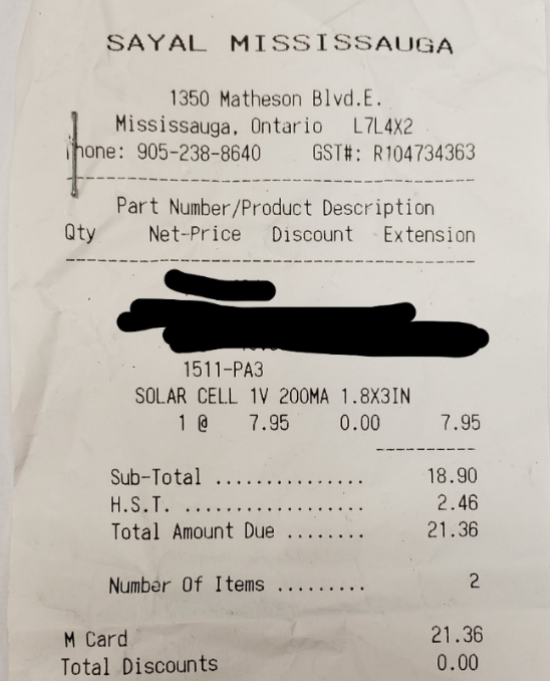

Solar Panel Gazebo
---------------
### November 20 2019 (Week 11)
-----------------
Case Has been 3D printed and assembled.The only issue i have is the lid wont fit due to the high of the pcb and sensors. I will be making a version 2 to properly enclose the raspberry pi.\
[Back Panel](Raspberry%20pi%20case/back_panel_SD.stl)\
[Bottom Panel](Raspberry%20pi%20case/bottom_panel.stl)\
[Front Panel](Raspberry%20pi%20case/front_panel_USB.stl)\
[Side Panel](Raspberry%20pi%20case/side_panel_GPIO_updated.stl)\
[Side Panel HDMI](Raspberry%20pi%20case/side_panel_HDMI.stl)\
[Top Panel](Raspberry%20pi%20case/top_panel.stl)

### November 14 2019 (Week 10)
-----------------

Progress Report
-----
This semester has been going very well so far. The proposal and Schedule were straight forward and required a little bit of research. Currently my financial status did have to change due to me realizing I need a few items along the way. I should’ve done a bit more research on what I have and what I will need over time. For example, I needed sockets and wire strippers. Currently I am over budget by ten dollars. Parts did come on time since I used amazon and local electronic stores. PCB design wasn’t an issue at first until I noticed that some of the wires were on the side of the board. The problem was noticed after soldering the board and realizing it and receiving feedback on how to fix the PCB. The PCB design did require some adjustments which led to a version two. Beard board milestone did take me a while to figure out why my sensors weren’t able to show their readings. It required me to change the code multiple of times to finally get it working. Majority of the progress has been perfectly on time and on schedule. The only thing I’m off schedule is the PCB soldered due to me requiring a version too. While I was waiting for version two of the PCB to be made, I decided to work on the case and get it ready of ahead of time thus making me not behind on future progresses. The PCB powered up will be demonstrated next week. The remaining work left is to complete my case design and have it ready as soon as possible so if I do have an issue, I won’t be behind. PCB testing and presentation are the remaining progresses. Therefore, all my progresses are on my repository and posted in the website to indicate what has been completed and will update the repository even more in the future.

### November 7 2019 (Week 9)
-----------------
The PCB Design of version one had issues with the current sensor layout. Wires were also place in the wrong position some were supposed to be on the top and some where supposed to be at the bottom so they have a proper connection to the sockets.
Version 2 of PCB has been made created [Version 2](Electronics/Version%202). And Hast also been sent to the prototype lab and will be soldered.

### October 31 2019 (Week 8)
-----------------
Sensors are working and are being displayed

Created [Readings Code](Code/simpletest.py).

### October 24 2019 (Reading Week)
-----------------
-Raspberry pi boot up
-able to ssh the raspberry pi through ethernet cable and through wifi.

### October 17 2019 (week 7)
------------
Created [PCB Design](https://github.com/E-Hajj/Ahmad/tree/master/Electronics).

### October 10 2019(Week 6)
--------------------------
Show your acquisitions/Check in meeting

### October 3 2019(Week 5)
-------------------
Proof of Payement 

### September 26 2019 (Week 4)
--------------------
Completed my [budget](documentation/Budget.pdf)

### September 19 2019 (Week 3)
----------------------------
Created [Project Schedule](documentation/ProjectSchedule.pdf).

### September 12 2019 (Week 2)
---------------------------
Created [Proposal](documentation/AhmadEl-HajjCENG317As1.pdf).

